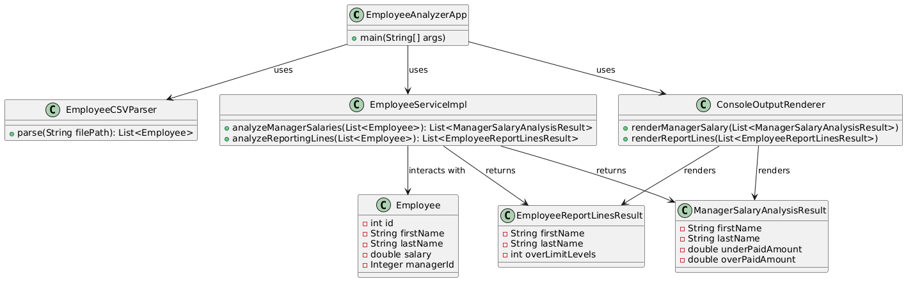
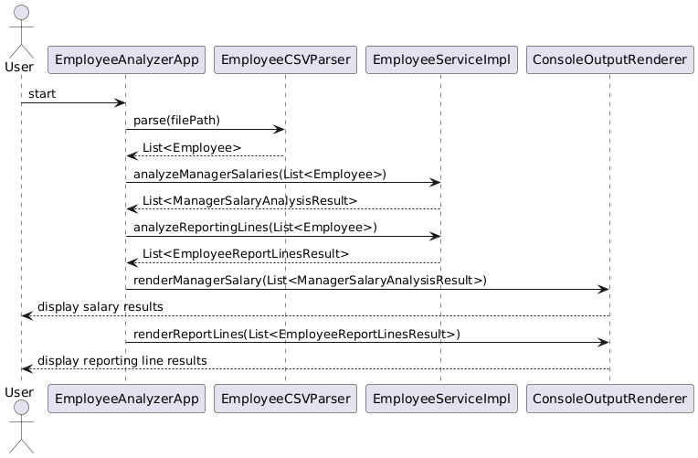

# Employee Analyzer Project

This project analyzes employee data from a CSV file, including:
- Manager salary comparisons (whether a manager is underpaid or overpaid based on their subordinates' salaries).
- Employee reporting hierarchy analysis (whether an employee has too many managers between them and the CEO).

## Requirements

- **Java 17+**
- **Maven**
- **A CSV file containing employee data.**

## Technologies Used

- **Java SE**
- **Lombok** (for simplifying code and logging)
- **JUnit** (for testing)
- **Log4j** (for logging)

## How to Run

1. **Clone the repository**:

   ```bash
   git clone <repository-url>
   cd employee-analyzer
   ```

2. **Build the project using Maven**:

   You can build the project with the following command:

   ```bash
   mvn clean install
   ```

   This will compile the code and run the JUnit tests to ensure everything is working correctly.

3. **Prepare a CSV File**:

   The application requires a CSV file in the following format:

   ```csv
   Id,FirstName,LastName,Salary,ManagerId
   123,Joe,Doe,60000,
   124,Martin,Chekov,45000,123
   125,Bob,Ronstad,47000,123
   300,Alice,Hasacat,50000,124
   305,Brett,Hardleaf,34000,300
   ```

    - The **`Id`** column represents the employee's unique identifier.
    - The **`FirstName`** and **`LastName`** columns represent the employee's name.
    - The **`Salary`** column represents the employee's salary.
    - The **`ManagerId`** column represents the ID of the employee's manager. If the employee is the CEO or has no manager, this field should be left empty.

4. **Run the Application**:

   Use the following command to run the application and analyze the CSV file:

   ```bash
   java -jar target/employee-analysis-1.0-SNAPSHOT.jar <path-to-your-csv-file>
   ```

   Example:

   ```bash
   java -jar target/employee-analysis-1.0-SNAPSHOT.jar src/main/resources/employees.csv
   ```

   The application will output:
    - Which managers are underpaid or overpaid.
    - Which employees have a reporting hierarchy that exceeds 4 levels.

5. **Logging**:

   Logs will be printed to the console, with detailed information about the execution process, including potential errors. Log levels can be adjusted via the `log4j2.xml` file located in `src/main/resources/`.

## Testing

The project uses **JUnit** for unit testing. To run the tests, use the following Maven command:

```bash
mvn test
```

## Diagrams

**Below is the class diagram of the project:**



**Below is the sequence diagram of the project:**


